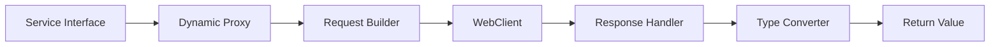

# Smootify

[](https://www.oracle.com/java/)
[](https://spring.io/projects/spring-boot)

> A powerful, type-safe dynamic HTTP client for Spring microservices

Smootify is an elegant implementation of a dynamic HTTP client that significantly simplifies service-to-service communication in microservices architecture. By leveraging Java's reflection capabilities and Spring's WebClient, it provides a seamless way to handle HTTP requests with minimal boilerplate code.

## Table of Contents

- [Features](#features)
- [Installation](#installation)
- [Usage](#usage)
- [Architecture](#architecture)
- [Configuration](#configuration)
- [Examples](#examples)
- [Contributing](#contributing)

## Features

🚀 **Annotation-Driven Development**
- Uses standard Spring annotations (`@GetMapping`, `@PostMapping`, etc.)
- Automatic endpoint and method detection
- Minimal configuration required

🔒 **Type-Safe Operations**
```java
// Define your service interface
public interface UserService {
    @GetMapping("/users/{id}")
    User getUser(@PathVariable Long id);
    
    @PostMapping("/users")
    User createUser(@RequestBody User user);
    
    @GetMapping("/users")
    Page<User> listUsers(@RequestParam int page, @RequestParam int size);
}

// Use it like a regular Spring component
@Autowired
private UserService userService;

// Make type-safe calls
User user = userService.getUser(123L);
```

🛠 **Smart Parameter Processing**
- Automatic handling of:
  - Path variables
  - Query parameters
  - Request body
  - Optional parameters
- Null-safe parameter handling

📝 **Built-in Response Types**
- Plain objects
- Lists
- Paginated results (`Page<T>`)
- Group count results
- Custom response types

🔐 **Security Integration**
- Automatic bearer token handling
- Seamless security context propagation

## Installation

Add the following dependency to your `pom.xml`:

```xml
<dependency>
    <groupId>com.uppwise.horizon</groupId>
    <artifactId>horizon-commons</artifactId>
    <version>${horizon.version}</version>
</dependency>
```

## Usage

1. Create your service interface:
```java
@SmootifyClient(baseUrl = "${api.users.url}")
public interface UserService {
    @GetMapping("/users")
    List<User> getAllUsers();
}
```

2. Enable Smootify in your configuration:
```java
@EnableSmootify(basePackages = "com.yourcompany.services")
@Configuration
public class SmootifyConfig {
}
```

3. Inject and use your service:
```java
@Service
public class UserManager {
    @Autowired
    private UserService userService;
    
    public List<User> getUsers() {
        return userService.getAllUsers();
    }
}
```

## Architecture

Smootify uses dynamic proxies to implement your service interfaces. The flow is:

1. Interface method invocation
2. Annotation processing
3. Request building
4. WebClient execution
5. Response transformation
6. Type-safe return



## Configuration

### Basic Configuration
```java
@Configuration
public class SmootifyConfig {
    @Bean
    public SmootifyConfigurer smootifyConfigurer() {
        return SmootifyConfigurer.builder()
            .timeout(Duration.ofSeconds(30))
            .retryAttempts(3)
            .build();
    }
}
```

### Security Configuration
```java
@Configuration
public class SmootifySecurityConfig {
    @Bean
    public SecurityTokenProvider tokenProvider() {
        return () -> SecurityContextHolder.getContext()
            .getAuthentication()
            .getCredentials()
            .toString();
    }
}
```

## Examples

### Pagination
```java
@GetMapping("/users")
Page<User> getUsers(Pageable pageable);

// Usage
Page<User> users = userService.getUsers(
    PageRequest.of(0, 20, Sort.by("name"))
);
```

### Complex Queries
```java
@GetMapping("/users/search")
List<User> searchUsers(
    @RequestParam String query,
    @RequestParam(required = false) UserRole role,
    @RequestParam(defaultValue = "false") boolean includeInactive
);
```

### Error Handling
```java
try {
    User user = userService.getUser(123L);
} catch (SmootifyException e) {
    if (e.getStatusCode() == HttpStatus.NOT_FOUND) {
        // Handle not found
    }
}
```

## Contributing

Contributions are welcome! Please read our [Contributing Guide](CONTRIBUTING.md) for details on our code of conduct and the process for submitting pull requests.


